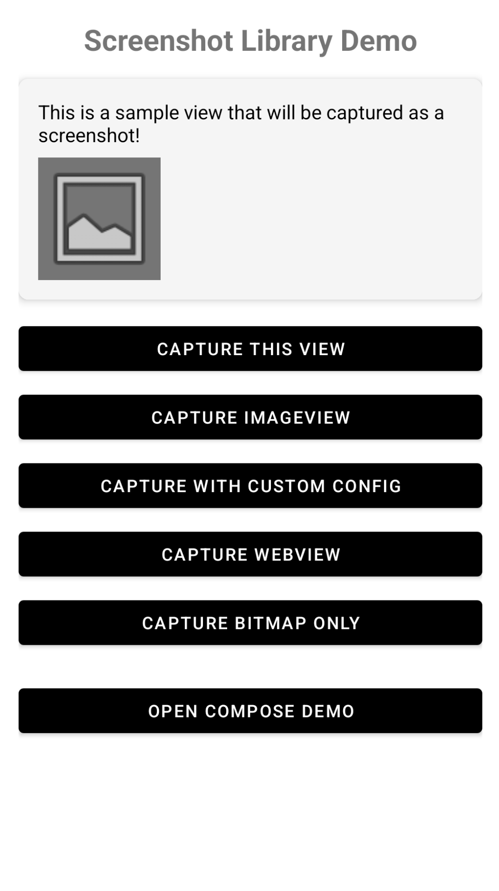

# Android Screenshot Library

[](https://search.maven.org/artifact/io.github.bolvitz/screenshot-android)
[](https://android-arsenal.com/api?level=21)
[](https://opensource.org/licenses/Apache-2.0)

A lightweight, powerful Android library for capturing screenshots of any view with advanced features like auto-detection, memory optimization, and specialized view handlers.

## ✨ Key Features

- 📸 **Universal View Support** - Capture any Android view (TextView, ImageView, VideoView, WebView, custom views, etc.)
- 🎯 **Auto-Detection** - Automatically finds and captures the best visible media view
- 🎬 **Media View Support** - Specialized handlers for PlayerView (Media3), TextureView, VideoView, ImageView, WebView
- 💾 **Memory Optimized** - Built-in bitmap recycling and memory management options
- 🔐 **Smart Permissions** - Automatic permission handling with Android version awareness
- ⚡ **High Performance** - Thread-safe, coroutine-based with minimal overhead
- 🎨 **Fully Configurable** - Control format (PNG/JPEG/WEBP), quality, filename, and storage location
- 🛠️ **Powerful Utilities** - Resize, crop, rotate, watermark, stitch, compare, and share screenshots
- 📱 **Modern Android** - Supports API 21+ with scoped storage for Android 10+
- 🪶 **Lightweight** - ~30KB impact with minimal dependencies
- ✅ **Well Tested** - 85%+ code coverage with 105+ unit tests

## 📱 Demo

See the library in action with our sample app featuring both traditional XML views and modern Jetpack Compose examples:

<p align="center">
  
</p>

The sample app demonstrates:
- ✅ Basic view capture with various configurations
- ✅ ImageView, WebView, and VideoView capture
- ✅ Custom screenshot configurations (format, quality, filename)
- ✅ Bitmap-only capture (no file saving)
- ✅ **Jetpack Compose integration** with @Preview support
- ✅ Permission handling examples

## 📦 Installation

### Maven Central (Recommended)

Add to your app's `build.gradle`:

```gradle
dependencies {
    implementation 'io.github.bolvitz:screenshot-android:1.1.0'
}
```

### JitPack (Alternative)

```gradle
repositories {
    maven { url 'https://jitpack.io' }
}

dependencies {
    implementation 'com.github.bolvitz:android-library-screenshot:1.1.0'
}
```

## 🚀 Quick Start

### Simple Capture

```kotlin
// One-line screenshot with default settings
ScreenshotBuilder.quickCapture(context, myView, object : ScreenshotCallback {
    override fun onSuccess(file: File, bitmap: Bitmap?) {
        Toast.makeText(context, "Saved: ${file.absolutePath}", Toast.LENGTH_SHORT).show()
    }

    override fun onError(exception: Exception, message: String) {
        Toast.makeText(context, "Error: $message", Toast.LENGTH_SHORT).show()
    }
})
```

### Builder Pattern

```kotlin
ScreenshotBuilder(context)
    .view(myView)
    .format(Bitmap.CompressFormat.JPEG)
    .quality(90)
    .fileName("my_screenshot.jpg")
    .saveToInternal()
    .capture { file, bitmap ->
        // Screenshot saved successfully
    }
```

## 📚 Usage Examples

### 1. Auto-Detect Best View

Automatically finds and captures visible media views in priority order: PlayerView → TextureView → WebView → VideoView → ImageView → Full Window

```kotlin
// Automatically detect and capture the best view
ScreenshotBuilder.quickCaptureAuto(activity, object : ScreenshotCallback {
    override fun onSuccess(file: File, bitmap: Bitmap?) {
        Log.d("Screenshot", "Auto-captured: ${file.name}")
    }

    override fun onError(exception: Exception, message: String) {
        Log.e("Screenshot", "Error: $message")
    }
})

// Or with builder
ScreenshotBuilder(activity)
    .autoDetectView()
    .capture { file, bitmap ->
        // Best view automatically captured
    }
```

### 2. Capture Entire Window

Captures the full screen including status bar and navigation bar:

```kotlin
ScreenshotBuilder.quickCaptureWindow(activity, object : ScreenshotCallback {
    override fun onSuccess(file: File, bitmap: Bitmap?) {
        // Full window screenshot saved
    }

    override fun onError(exception: Exception, message: String) {
        // Handle error
    }
})
```

### 3. Capture Content View Only

Captures app content without system UI:

```kotlin
ScreenshotBuilder(activity)
    .captureContent()  // Content view only
    .format(Bitmap.CompressFormat.PNG)
    .capture { file, bitmap ->
        // Content captured without system bars
    }
```

### 4. Capture PlayerView (Media3)

Perfect for video streaming apps:

```kotlin
val playerView = findViewById<androidx.media3.ui.PlayerView>(R.id.player_view)

ScreenshotBuilder(this)
    .view(playerView)
    .fileName("video_frame.png")
    .capture { file, bitmap ->
        // Current video frame captured
    }
```

### 5. Capture TextureView

For camera preview or video rendering:

```kotlin
val textureView = findViewById<TextureView>(R.id.texture_view)

ScreenshotBuilder(this)
    .view(textureView)
    .format(Bitmap.CompressFormat.JPEG)
    .quality(95)
    .capture { file, bitmap ->
        // TextureView content captured
    }
```

### 6. Capture WebView (Full Content)

Captures entire WebView content, not just visible area:

```kotlin
val webView = findViewById<WebView>(R.id.web_view)

ScreenshotBuilder(this)
    .view(webView)
    .includeBackground(true)
    .capture { file, bitmap ->
        // Full WebView content captured (scrollable area)
    }
```

### 7. Memory Optimization

Automatically recycle bitmaps to save memory:

```kotlin
ScreenshotBuilder(this)
    .view(myView)
    .recycleBitmapAfterSave(true)  // Auto-recycle after saving
    .capture { file, bitmap ->
        // bitmap will be null here (already recycled)
        // Only file is available - perfect for large screenshots
    }

// Or if you don't need bitmap at all
ScreenshotBuilder(this)
    .view(myView)
    .returnBitmap(false)  // Don't return bitmap (save memory)
    .capture { file, bitmap ->
        // bitmap is null, only file path available
    }
```

### 8. Custom Configuration

```kotlin
ScreenshotBuilder(this)
    .view(myView)
    .format(Bitmap.CompressFormat.JPEG)  // Use JPEG
    .quality(85)                          // 85% quality
    .fileName("custom_${System.currentTimeMillis()}.jpg")
    .saveDirectory(File(getExternalFilesDir(null), "MyScreenshots"))
    .includeBackground(true)
    .capture { file, bitmap ->
        Log.d("Screenshot", "Saved: ${file.absolutePath}")
        bitmap?.let {
            // Use bitmap if needed
            Log.d("Screenshot", "Size: ${it.width}x${it.height}")
        }
    }
```

### 9. Get Bitmap Without Saving

```kotlin
// Synchronous (blocks current thread)
try {
    val bitmap = ScreenshotBuilder.quickCaptureBitmap(this, myView)
    imageView.setImageBitmap(bitmap)
} catch (e: Exception) {
    Log.e("Screenshot", "Error: ${e.message}")
}

// Asynchronous (recommended)
lifecycleScope.launch {
    try {
        val bitmap = ScreenshotBuilder(this@MainActivity)
            .view(myView)
            .captureBitmapAsync()
        imageView.setImageBitmap(bitmap)
    } catch (e: Exception) {
        Log.e("Screenshot", "Error: ${e.message}")
    }
}
```

### 10. Using Kotlin Coroutines

```kotlin
lifecycleScope.launch {
    val result = ScreenshotBuilder(this@MainActivity)
        .view(myView)
        .format(Bitmap.CompressFormat.PNG)
        .captureAsync()  // Suspend function

    when (result) {
        is ScreenshotResult.Success -> {
            Log.d("Screenshot", "Saved: ${result.file.absolutePath}")
            result.bitmap?.let {
                // Use bitmap if available
            }
        }
        is ScreenshotResult.Error -> {
            Log.e("Screenshot", "Error: ${result.message}")
        }
    }
}
```

### 11. Jetpack Compose Integration

Capture Compose UI by wrapping composables in AndroidView:

```kotlin
@Composable
fun ScreenshotDemo() {
    val context = LocalContext.current
    var captureableView by remember { mutableStateOf<View?>(null) }
    var resultText by remember { mutableStateOf("") }

    Column {
        // Wrap your Compose content in AndroidView to make it capturable
        AndroidView(
            modifier = Modifier.fillMaxWidth(),
            factory = { ctx ->
                ComposeView(ctx).apply {
                    setContent {
                        // Your composable content here
                        Card {
                            Column(modifier = Modifier.padding(16.dp)) {
                                Text("This Compose UI can be captured!")
                                Box(
                                    modifier = Modifier
                                        .size(100.dp)
                                        .background(Color.Gray)
                                )
                            }
                        }
                    }
                    captureableView = this
                }
            }
        )

        // Capture button
        Button(
            onClick = {
                captureableView?.let { view ->
                    ScreenshotBuilder.quickCapture(
                        context = context,
                        view = view,
                        callback = object : ScreenshotCallback {
                            override fun onSuccess(file: File, bitmap: Bitmap?) {
                                resultText = "Screenshot saved: ${file.name}"
                            }
                            override fun onError(exception: Exception, message: String) {
                                resultText = "Error: $message"
                            }
                        }
                    )
                }
            }
        ) {
            Text("Capture Compose Content")
        }

        // Alternative: Capture full screen
        Button(
            onClick = {
                val activity = context as? ComponentActivity
                activity?.window?.decorView?.rootView?.let { rootView ->
                    ScreenshotBuilder(context)
                        .view(rootView)
                        .fileName("compose_fullscreen.png")
                        .capture { file, bitmap ->
                            resultText = "Full screen captured: ${file.name}"
                        }
                }
            }
        ) {
            Text("Capture Full Screen")
        }

        if (resultText.isNotEmpty()) {
            Text(resultText)
        }
    }
}
```

**Note**: Compose UI must be wrapped in `ComposeView` within `AndroidView` to be capturable as a traditional Android View. See the sample app's `ComposeActivity` for a complete working example with @Preview support.

## 💾 Storage Options

### Internal Storage (Default - No Permissions Required)

```kotlin
ScreenshotBuilder(this)
    .view(myView)
    .saveToInternal()  // App's private directory
    .capture { file, bitmap -> }
```

**Location**: `/data/data/your.package.name/files/Screenshots/`

✅ No permissions needed
✅ Secure (only your app can access)
❌ Deleted when app is uninstalled

### External Storage

```kotlin
ScreenshotBuilder(this)
    .view(myView)
    .saveToExternal()  // External storage
    .capture { file, bitmap -> }
```

**Behavior by Android Version**:
- **Android 10+ (API 29+)**: App-specific directory, no permissions needed
- **Android 6-9 (API 23-28)**: Requires `WRITE_EXTERNAL_STORAGE` permission
- **Android < 6 (API < 23)**: No runtime permissions needed

**Location**:
- Android 10+: `/Android/data/your.package/files/Pictures/Screenshots/`
- Android < 10: `/Pictures/Screenshots/`

## 🔐 Permission Handling

The library automatically handles permissions based on Android version:

### Check Permission

```kotlin
if (ScreenshotBuilder.isPermissionNeeded(this, isExternalStorage = true)) {
    // Permission is required
    ScreenshotBuilder.requestPermission(this)
}
```

### Handle Permission Result

```kotlin
override fun onRequestPermissionsResult(
    requestCode: Int,
    permissions: Array<out String>,
    grantResults: IntArray
) {
    super.onRequestPermissionsResult(requestCode, permissions, grantResults)

    if (PermissionHelper.onRequestPermissionsResult(requestCode, permissions, grantResults)) {
        // Permission granted - proceed with screenshot
        captureScreenshot()
    } else {
        // Permission denied
        Toast.makeText(this, "Permission required for external storage", Toast.LENGTH_LONG).show()
    }
}
```

### Add to Manifest (for Android 6-9)

```xml
<uses-permission android:name="android.permission.WRITE_EXTERNAL_STORAGE"
    android:maxSdkVersion="28" />
```

## 📁 Storage Management

### Get All Screenshots

```kotlin
val screenshotCapture = ScreenshotCapture(context)
val storageManager = screenshotCapture.getStorageManager()

// Get all screenshots from internal storage
val screenshots = storageManager.getAllScreenshots(StorageLocation.INTERNAL)

screenshots.forEach { file ->
    Log.d("Screenshot", "File: ${file.name}, Size: ${file.length() / 1024}KB")
}

// With pagination
val recent10 = storageManager.getAllScreenshots(
    storageLocation = StorageLocation.INTERNAL,
    limit = 10,
    offset = 0
)
```

### Delete Screenshot

```kotlin
val deleted = storageManager.deleteScreenshot(file)
if (deleted) {
    Log.d("Screenshot", "File deleted successfully")
}
```

### Clear All Screenshots

```kotlin
val count = storageManager.clearAllScreenshots(StorageLocation.INTERNAL)
Log.d("Screenshot", "Deleted $count screenshots")
```

## 🎯 API Reference

### ScreenshotBuilder Methods

| Method | Description | Default |
|--------|-------------|---------|
| `view(View)` | Set the view to capture | Required |
| `autoDetectView()` | Auto-detect best visible view | - |
| `captureWindow()` | Capture entire window (with system UI) | - |
| `captureContent()` | Capture content view only (without system UI) | - |
| `format(CompressFormat)` | Image format (PNG/JPEG/WEBP) | PNG |
| `quality(Int)` | Quality 0-100 (JPEG/WEBP only) | 100 |
| `fileName(String)` | Custom filename | Auto-generated timestamp |
| `saveDirectory(File)` | Custom save directory | App's default directory |
| `includeBackground(Boolean)` | Include view background | `true` |
| `recycleBitmapAfterSave(Boolean)` | Auto-recycle bitmap after save | `false` |
| `returnBitmap(Boolean)` | Return bitmap in callback | `true` |
| `saveToInternal()` | Save to internal storage | Default |
| `saveToExternal()` | Save to external storage | - |
| `capture(callback)` | Execute capture with callback | - |
| `captureAsync()` | Suspend function for coroutines | - |
| `captureBitmap()` | Get bitmap without saving (sync) | - |
| `captureBitmapAsync()` | Get bitmap without saving (async) | - |
| `release()` | Release resources | Call when done |

### Quick Static Methods

```kotlin
// Quick capture with default settings
ScreenshotBuilder.quickCapture(context, view, callback)

// Auto-detect best view
ScreenshotBuilder.quickCaptureAuto(activity, callback)

// Capture window
ScreenshotBuilder.quickCaptureWindow(activity, callback)

// Capture content
ScreenshotBuilder.quickCaptureContent(activity, callback)

// Get bitmap only
ScreenshotBuilder.quickCaptureBitmap(context, view)

// Permission helpers
ScreenshotBuilder.isPermissionNeeded(context, isExternal)
ScreenshotBuilder.requestPermission(activity)
```

### ScreenshotConfig

```kotlin
data class ScreenshotConfig(
    val format: Bitmap.CompressFormat = PNG,
    val quality: Int = 100,
    val saveDirectory: File? = null,
    val fileName: String? = null,
    val includeBackground: Boolean = true,
    val recycleBitmapAfterSave: Boolean = false,
    val returnBitmap: Boolean = true
)
```

### ScreenshotCallback

```kotlin
interface ScreenshotCallback {
    fun onSuccess(file: File, bitmap: Bitmap?)
    fun onError(exception: Exception, message: String)
}
```

### ScreenshotResult (for Coroutines)

```kotlin
sealed class ScreenshotResult {
    data class Success(val file: File, val bitmap: Bitmap?) : ScreenshotResult()
    data class Error(val exception: Exception, val message: String) : ScreenshotResult()
}
```

## ⚡ Performance Tips

1. **Use `recycleBitmapAfterSave(true)`** for large screenshots to save memory
2. **Use `returnBitmap(false)`** if you only need the file path
3. **Use `captureAsync()`** with coroutines for better threading
4. **Call `release()`** on ScreenshotBuilder when done to free resources
5. **Use JPEG format** with 85-90% quality for smaller file sizes
6. **Capture on background thread** for UI responsiveness

```kotlin
// Memory-efficient capture
lifecycleScope.launch(Dispatchers.Default) {
    val result = ScreenshotBuilder(this@MainActivity)
        .view(largeView)
        .format(Bitmap.CompressFormat.JPEG)
        .quality(85)
        .recycleBitmapAfterSave(true)
        .captureAsync()

    withContext(Dispatchers.Main) {
        when (result) {
            is ScreenshotResult.Success -> {
                // Update UI
            }
            is ScreenshotResult.Error -> {
                // Show error
            }
        }
    }
}
```

## 🎬 Specialized View Handlers

The library automatically selects the best handler for each view type:

- **StandardViewHandler** - Regular views (TextView, Button, LinearLayout, etc.)
- **ImageViewHandler** - Optimized for ImageView (direct bitmap access)
- **WebViewHandler** - Captures full scrollable WebView content
- **VideoViewHandler** - Captures current video frame from VideoView
- **TextureViewHandler** - Captures TextureView content (camera, video)
- **PlayerViewHandler** - Captures Media3 PlayerView (ExoPlayer)

No configuration needed - handlers are selected automatically!

## ❌ Error Handling

```kotlin
ScreenshotBuilder(this)
    .view(myView)
    .capture(
        onSuccess = { file, bitmap ->
            // Success
        },
        onError = { exception, message ->
            when (exception) {
                is SecurityException -> {
                    // Permission denied
                    Log.e("Screenshot", "Permission issue: $message")
                }
                is IllegalStateException -> {
                    // Invalid view state or configuration
                    Log.e("Screenshot", "Invalid state: $message")
                }
                is IOException -> {
                    // Storage/file system error
                    Log.e("Screenshot", "Storage error: $message")
                }
                else -> {
                    Log.e("Screenshot", "Unknown error: $message")
                }
            }
        }
    )
```

## 🛠️ Screenshot Utilities

The library includes powerful utility functions for transforming, analyzing, and sharing screenshots.

### Image Transformations

#### Resize with Aspect Ratio

```kotlin
import com.screenshot.lib.utils.ScreenshotUtils

// Resize maintaining aspect ratio
val resized = ScreenshotUtils.resize(
    bitmap = originalBitmap,
    maxWidth = 1080,
    maxHeight = 1920,
    maintainAspectRatio = true
)

// Resize to exact dimensions (may distort)
val exactSize = ScreenshotUtils.resize(
    bitmap = originalBitmap,
    maxWidth = 500,
    maxHeight = 500,
    maintainAspectRatio = false
)
```

#### Crop to Specific Area

```kotlin
// Crop a region from the screenshot
val cropped = ScreenshotUtils.crop(
    bitmap = originalBitmap,
    x = 100,        // Start X
    y = 200,        // Start Y
    width = 300,    // Width of crop area
    height = 400    // Height of crop area
)

// Crop center portion
val centerCropped = ScreenshotUtils.crop(
    bitmap = originalBitmap,
    x = originalBitmap.width / 4,
    y = originalBitmap.height / 4,
    width = originalBitmap.width / 2,
    height = originalBitmap.height / 2
)
```

#### Rotate Screenshot

```kotlin
// Rotate 90 degrees clockwise
val rotated90 = ScreenshotUtils.rotate(originalBitmap, 90f)

// Rotate 180 degrees
val rotated180 = ScreenshotUtils.rotate(originalBitmap, 180f)

// Rotate 270 degrees (or -90 degrees)
val rotated270 = ScreenshotUtils.rotate(originalBitmap, 270f)
```

#### Add Watermark

```kotlin
// Simple watermark
val watermarked = ScreenshotUtils.addWatermark(
    bitmap = originalBitmap,
    text = "© 2024 MyApp"
)

// Customized watermark
val customWatermark = ScreenshotUtils.addWatermark(
    bitmap = originalBitmap,
    text = "Confidential",
    textSize = 32f,        // Text size in pixels
    alpha = 128,           // 0-255 (128 = 50% transparent)
    x = 20f,              // X position from left
    y = originalBitmap.height - 50f  // Y position from top
)

// Bottom-right watermark
val bottomRight = ScreenshotUtils.addWatermark(
    bitmap = originalBitmap,
    text = "@myusername",
    textSize = 24f,
    alpha = 180,
    x = originalBitmap.width - 200f,
    y = originalBitmap.height - 30f
)
```

### Image Composition

#### Stitch Screenshots Vertically

```kotlin
// Capture multiple sections and combine
val screenshot1 = ScreenshotBuilder(this).view(view1).captureBitmapAsync()
val screenshot2 = ScreenshotBuilder(this).view(view2).captureBitmapAsync()
val screenshot3 = ScreenshotBuilder(this).view(view3).captureBitmapAsync()

// Combine vertically (top to bottom)
val stitched = ScreenshotUtils.combineVertically(
    bitmaps = listOf(screenshot1, screenshot2, screenshot3),
    spacing = 10  // 10px spacing between images
)

// Save the combined result
ScreenshotBuilder(this)
    .view(imageView.apply { setImageBitmap(stitched) })
    .fileName("stitched_vertical.png")
    .capture { file, _ ->
        Log.d("Screenshot", "Stitched screenshot saved: ${file.absolutePath}")
    }
```

#### Stitch Screenshots Horizontally

```kotlin
// Combine horizontally (left to right)
val panorama = ScreenshotUtils.combineHorizontally(
    bitmaps = listOf(screenshot1, screenshot2, screenshot3),
    spacing = 5  // 5px spacing
)
```

**Use Case**: Create scrolling screenshots by capturing sections and stitching them together.

### Image Analysis

#### Compare Screenshots

```kotlin
// Compare two screenshots for similarity
val similarity = ScreenshotUtils.compareBitmaps(
    bitmap1 = originalScreenshot,
    bitmap2 = newScreenshot,
    sampleSize = 10  // Sample every 10th pixel for performance
)

when {
    similarity > 0.95f -> Log.d("Compare", "Screenshots are nearly identical")
    similarity > 0.7f -> Log.d("Compare", "Screenshots are similar")
    similarity > 0.3f -> Log.d("Compare", "Screenshots have some differences")
    else -> Log.d("Compare", "Screenshots are very different")
}

// Use case: Automated testing, change detection
val isUnchanged = similarity > 0.98f
```

#### Get File Size

```kotlin
// Human-readable file size
val fileSize = ScreenshotUtils.getReadableFileSize(screenshotFile)
Log.d("Screenshot", "File size: $fileSize")  // "1.5 MB"

// Memory size of bitmap
val memorySize = ScreenshotUtils.getBitmapMemorySize(bitmap)
Log.d("Screenshot", "Memory usage: ${memorySize / 1024 / 1024}MB")
```

### Sharing Screenshots

#### Create Share Intent

```kotlin
// Share screenshot with other apps
val shareIntent = ScreenshotUtils.createShareIntent(
    context = this,
    file = screenshotFile,
    authority = "com.yourapp.fileprovider",  // Your FileProvider authority
    title = "Share Screenshot"
)

shareIntent?.let {
    startActivity(it)
}
```

**Setup FileProvider** (required for sharing):

Add to `AndroidManifest.xml`:

```xml
<provider
    android:name="androidx.core.content.FileProvider"
    android:authorities="com.yourapp.fileprovider"
    android:exported="false"
    android:grantUriPermissions="true">
    <meta-data
        android:name="android.support.FILE_PROVIDER_PATHS"
        android:resource="@xml/file_paths" />
</provider>
```

Create `res/xml/file_paths.xml`:

```xml
<?xml version="1.0" encoding="utf-8"?>
<paths>
    <files-path name="screenshots" path="Screenshots/" />
    <external-files-path name="external_screenshots" path="Pictures/Screenshots/" />
</paths>
```

### Complete Transformation Example

```kotlin
// Capture, transform, and share
lifecycleScope.launch {
    // 1. Capture screenshot
    val builder = ScreenshotBuilder(this@MainActivity)
    val originalBitmap = builder.view(myView).captureBitmapAsync()

    // 2. Resize for social media (1080x1080)
    val resized = ScreenshotUtils.resize(originalBitmap, 1080, 1080)

    // 3. Add watermark
    val watermarked = ScreenshotUtils.addWatermark(
        bitmap = resized,
        text = "© MyApp 2024",
        textSize = 28f,
        alpha = 150,
        x = 20f,
        y = resized.height - 40f
    )

    // 4. Save transformed image
    val result = builder
        .view(ImageView(this@MainActivity).apply {
            setImageBitmap(watermarked)
        })
        .format(Bitmap.CompressFormat.JPEG)
        .quality(90)
        .fileName("transformed_screenshot.jpg")
        .captureAsync()

    // 5. Share
    when (result) {
        is ScreenshotResult.Success -> {
            val shareIntent = ScreenshotUtils.createShareIntent(
                this@MainActivity,
                result.file,
                "com.yourapp.fileprovider"
            )
            shareIntent?.let { startActivity(it) }
        }
        is ScreenshotResult.Error -> {
            Log.e("Screenshot", "Error: ${result.message}")
        }
    }

    // 6. Cleanup
    originalBitmap.recycle()
    builder.release()
}
```

### Batch Processing Example

```kotlin
// Process multiple screenshots
lifecycleScope.launch {
    val views = listOf(view1, view2, view3, view4)
    val screenshots = mutableListOf<Bitmap>()

    // Capture all views
    views.forEach { view ->
        val bitmap = ScreenshotBuilder(this@MainActivity)
            .view(view)
            .captureBitmapAsync()

        // Resize each screenshot
        val resized = ScreenshotUtils.resize(bitmap, 800, 600)
        screenshots.add(resized)

        bitmap.recycle()  // Free original
    }

    // Create a grid (2x2)
    val row1 = ScreenshotUtils.combineHorizontally(
        screenshots.subList(0, 2),
        spacing = 10
    )
    val row2 = ScreenshotUtils.combineHorizontally(
        screenshots.subList(2, 4),
        spacing = 10
    )

    val grid = row1?.let { r1 ->
        row2?.let { r2 ->
            ScreenshotUtils.combineVertically(listOf(r1, r2), spacing = 10)
        }
    }

    // Save grid
    grid?.let {
        // Save the grid image
        // ... save logic

        // Cleanup
        screenshots.forEach { it.recycle() }
        row1.recycle()
        row2.recycle()
        grid.recycle()
    }
}
```

### API Reference - ScreenshotUtils

| Method | Description | Returns |
|--------|-------------|---------|
| `resize(bitmap, maxWidth, maxHeight, maintainAspectRatio)` | Resize bitmap to fit dimensions | `Bitmap` |
| `crop(bitmap, x, y, width, height)` | Crop bitmap to specific area | `Bitmap` |
| `rotate(bitmap, degrees)` | Rotate bitmap by degrees | `Bitmap` |
| `addWatermark(bitmap, text, textSize, alpha, x, y)` | Add text watermark to bitmap | `Bitmap` |
| `combineVertically(bitmaps, spacing)` | Stitch bitmaps top to bottom | `Bitmap?` |
| `combineHorizontally(bitmaps, spacing)` | Stitch bitmaps left to right | `Bitmap?` |
| `compareBitmaps(bitmap1, bitmap2, sampleSize)` | Compare similarity (0.0-1.0) | `Float` |
| `createShareIntent(context, file, authority, title)` | Create share intent for file | `Intent?` |
| `getReadableFileSize(file)` | Get file size as string | `String` |
| `getBitmapMemorySize(bitmap)` | Calculate bitmap memory usage | `Long` |

**Note**: All transformation methods create new bitmaps and don't modify the original. Remember to recycle bitmaps when done to free memory.

## 📋 Requirements

- **Min SDK**: 21 (Android 5.0 Lollipop)
- **Target SDK**: 34 (Android 14)
- **Kotlin**: 1.9.20+
- **Dependencies**:
  - `androidx.core:core-ktx:1.12.0`
  - `androidx.appcompat:appcompat:1.6.1`
  - `org.jetbrains.kotlinx:kotlinx-coroutines-android:1.7.3`
- **Optional Dependencies** (for PlayerView support):
  - `androidx.media3:media3-ui:1.2.0` (compile-only)
  - `androidx.media3:media3-common:1.2.0` (compile-only)

## 📱 Sample App

Check the `/sample` module for a complete sample application with examples of:

**Traditional XML Layout (MainActivity)**:
- Basic view capture
- Auto-detection
- Full window capture
- ImageView, WebView, VideoView capture
- Custom configuration
- Permission handling
- Storage management
- Memory optimization

**Jetpack Compose (ComposeActivity)**:
- Capturing Compose UI via AndroidView
- Full screen capture in Compose apps
- @Preview annotations for quick UI testing
- Code examples and live demonstrations
- Modern Material3 design with black & white theme

Run the sample:
```bash
./gradlew :sample:installDebug
```

## 🤝 Contributing

Contributions are welcome! Please:

1. Fork the repository
2. Create a feature branch (`git checkout -b feature/AmazingFeature`)
3. Commit your changes (`git commit -m 'Add AmazingFeature'`)
4. Push to the branch (`git push origin feature/AmazingFeature`)
5. Open a Pull Request

## 📄 License

```
Copyright 2024 bolvitz

Licensed under the Apache License, Version 2.0 (the "License");
you may not use this file except in compliance with the License.
You may obtain a copy of the License at

    http://www.apache.org/licenses/LICENSE-2.0

Unless required by applicable law or agreed to in writing, software
distributed under the License is distributed on an "AS IS" BASIS,
WITHOUT WARRANTIES OR CONDITIONS OF ANY KIND, either express or implied.
See the License for the specific language governing permissions and
limitations under the License.
```

## 🔗 Links

- **Maven Central**: https://search.maven.org/artifact/io.github.bolvitz/screenshot-android
- **GitHub**: https://github.com/bolvitz/android-library-screenshot
- **Issues**: https://github.com/bolvitz/android-library-screenshot/issues
- **Changelog**: https://github.com/bolvitz/android-library-screenshot/releases

## ⭐ Support

If you find this library helpful, please:
- ⭐ Star the repository
- 🐛 Report issues
- 💡 Suggest features
- 🤝 Contribute code

---

Made with ❤️ by [bolvitz](https://github.com/bolvitz)
